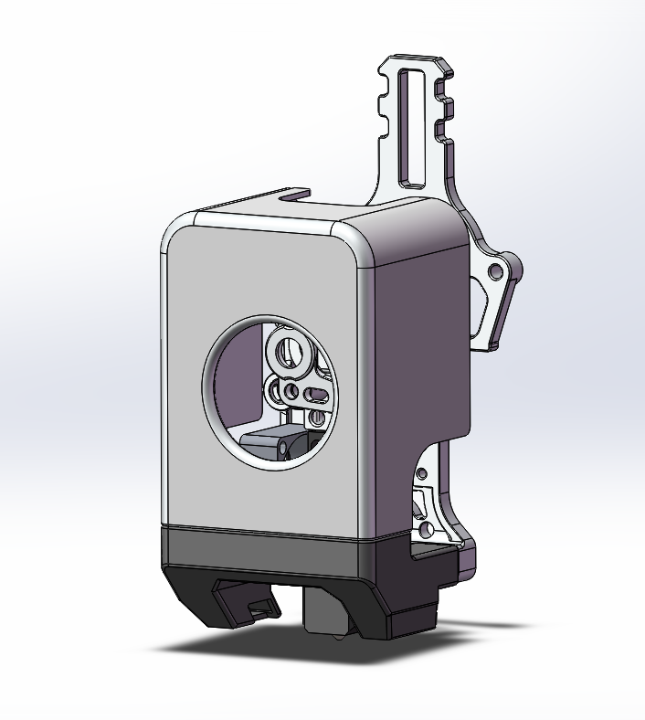
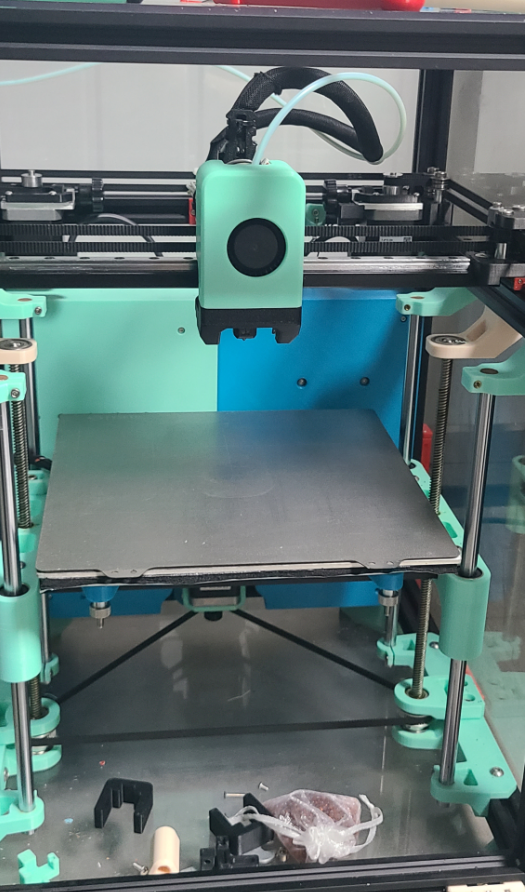

# EZ PRINTHEAD

一款 EASY 简单的打印头

挤出机设计来自大鱼 TT 使用夏尔巴齿轮

热端使用拓竹 P1 热端

5015 风道 磁吸设计 使用 5\*2 磁铁

挤出机电机使用 36 圆饼电机

可适配挂载 klicky IDM M8 接近开关 等多种调平方案

## BOM

| 名称           | 数量 |
| -------------- | ---- |
| 5015 鼓风机    | 1    |
| 2510 风扇      | 1    |
| 5\*2 磁铁      | 8    |
| BMG 挤出机套件 | 1    |
| M2.5\*14 螺丝  | 2    |
